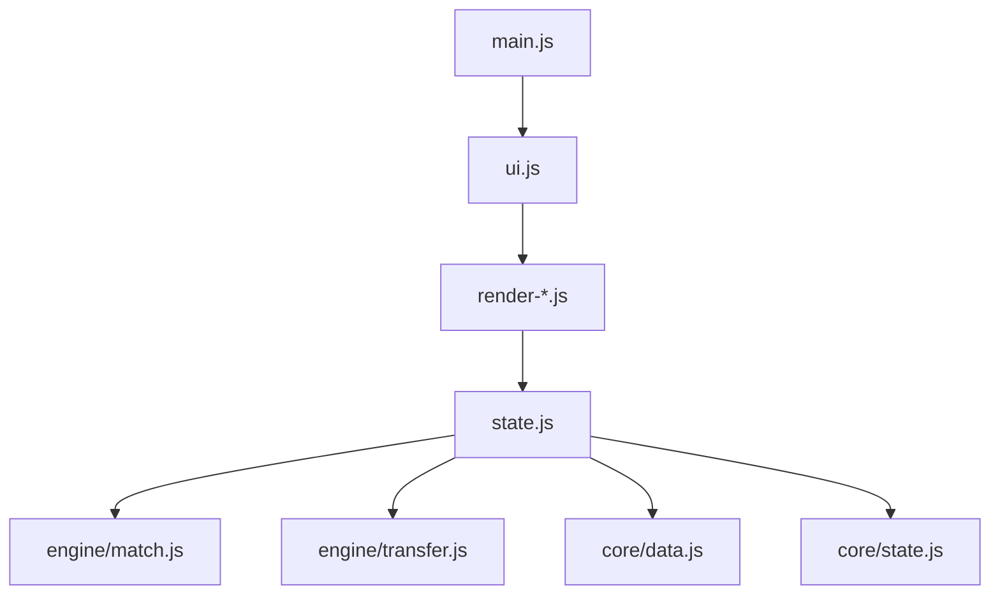

# 🚀 KPL 电竞经理 - 完整迭代路线图

## 📋 总体时间线

```
🎯 第 1 阶段：基础加固（2-3 周）
├── P0: 测试门禁强化
├── P1: 性能基线建立  
├── P2: 文档体系完善

🎯 第 2 阶段：体验升级（4-6 周）
├── P0: BGM 控制系统
├── P1: 移动端触控优化
└── P2: 高对比度模式

🎯 第 3 阶段：功能扩展（8-10 周）
├── P0: 模组支持框架
├── P1: 数据可视化面板
└── P2: 教程视频体系

🎯 第 4 阶段：架构演进（12-16 周）
├── P0: core/engine/ui 分层
├── P1: 插件化设计
└── P2: WASM 性能优化
```

---

## 🎯 第一阶段：基础加固（Weeks 1-3）

### P0.01 - 测试门禁强化

#### 任务清单

```javascript
// 新增三门禁 (预计工作量：5 天)
const NEW_GATES = [
  {
    id: 'verify-performance-baseline',
    description: '性能基准门禁：页面渲染 FPS ≥ 55, 内存增长 ≤ 5MB/赛季',
    file: 'tests/verify-performance-baseline.js',
    priority: 'P0' // 必须，否则 CI 无法合并
  },
  {
    id: 'verify-mobile-compat',
    description: '移动端兼容性：≤640px 宽度下所有交互可用，无布局错乱',
    file: 'tests/verify-mobile-compat.js',
    priority: 'P1'
  },
  {
    id: 'verify-accessibility',
    description: '无障碍访问：键盘导航全覆盖，色彩对比度 AA 级通过',
    file: 'tests/verify-accessibility.js', 
    priority: 'P2'
  }
];
```

#### 实施步骤

**Day 1-2: 编写 `verify-performance-baseline.js`**

```javascript
// tests/verify-performance-baseline.js
const vm = require('vm');
const { makeDom } = require('./harness');

const T = require('./harness').makeTester('性能基线');

const dom = makeDom().dom;

// 关键指标采集
function collectPerfMetrics() {
  return vm.runInContext(`
    (function(){
      const metrics = {};
      
      // FPS 测量 (performance.now + requestAnimationFrame)
      let frameCount = 0;
      let startTime = performance.now();
      
      function measureFPS() {
        return new Promise(resolve => {
          const start = performance.now();
          function loop() {
            frameCount++;
            if (performance.now() - start < 1000) {
              requestAnimationFrame(loop);
            } else {
              metrics.fps = Math.round(frameCount);
              resolve();
            }
          }
          loop();
        });
      }
      
      // 内存使用 (Chrome DevTools API)
      try {
        if (performance.memory) {
          metrics.memoryUsed = Math.round(performance.memory.usedJSHeapSize / 1024 / 1024);
          metrics.memoryLimit = Math.round(performance.memory.jsHeapSizeLimit / 1024 / 1024);
        }
      } catch(e) {
        metrics.memoryNote = '非 Chrome 环境，跳过';
      }
      
      // 渲染耗时
      metrics.renderTime = perfMonitor?.lastRenderTime || 0;
      
      return metrics;
    })()
  `, dom);
}

async function runTest() {
  const metrics = await collectPerfMetrics();
  
  // 断言
  if (metrics.fps < 55) {
    T.check(false, `FPS ${metrics.fps} 低于基线 55`);
  } else {
    T.check(true, `FPS ${metrics.fps} ✓`);
  }
  
  if (metrics.memoryUsed && metrics.memoryUsed > 50) {
    T.check(false, `内存使用 ${metrics.memoryUsed}MB 超过阈值 50MB`);
  } else if (!metrics.memoryNote) {
    T.check(true, `内存 ${metrics.memoryUsed}/${metrics.memoryLimit}MB ✓`);
  }
  
  if (metrics.renderTime > 50) {
    T.check(false, `单次渲染耗时 ${metrics.renderTime}ms 超过基线 50ms`);
  } else {
    T.check(true, `渲染耗时 ${metrics.renderTime}ms ✓`);
  }
  
  T.report();
}

runTest();
```

**Day 3-4: 编写 `verify-mobile-compat.js`**

```javascript
// tests/verify-mobile-compat.js
const puppeteer = require('puppeteer');
const fs = require('fs');
const path = require('path');

async function testMobileCompat() {
  const gameHtml = fs.readFileSync('game.html', 'utf8');
  const tempDir = path.join(__dirname, '.tmp-mobile-test');
  if (!fs.existsSync(tempDir)) fs.mkdirSync(tempDir);
  fs.writeFileSync(path.join(tempDir, 'game.html'), gameHtml);
  
  const browser = await puppeteer.launch({ headless: true });
  const page = await browser.newPage();
  
  // 模拟 iPhone SE (375x667)
  await page.setViewport({ width: 375, height: 667, deviceScaleFactor: 2 });
  await page.goto(`file://${path.join(tempDir, 'game.html')}`);
  
  const issues = [];
  
  // 测试 1: 所有按钮点击区域
  const buttons = await page.$$('.btn');
  for (const button of buttons) {
    const box = await button.boundingBox();
    if (!box || (box.height < 44 || box.width < 44)) {
      issues.push(`按钮太小: ${box.width}x${box.height}px`);
    }
  }
  
  // 测试 2: 页面元素是否溢出
  const bodyContent = await page.evaluate(() => {
    const elements = document.querySelectorAll('*');
    const overflow = [];
    
    elements.forEach(el => {
      const rect = el.getBoundingClientRect();
      const style = window.getComputedStyle(el);
      
      if (rect.left < 0 || rect.top < 0 || 
          rect.right > 375 || rect.bottom > 667) {
        overflow.push({
          tag: el.tagName,
          className: el.className,
          offsetLeft: rect.left,
          offsetTop: rect.top
        });
      }
    });
    
    return overflow;
  });
  
  if (bodyContent.length > 0) {
    issues.push(`元素溢出：${bodyContent.length}个`);
  }
  
  // 测试 3: 交互式元素可点击性
  const clickable = await page.evaluate(() => {
    const interactive = document.querySelectorAll('[onclick], button, a');
    let count = 0;
    
    interactive.forEach(el => {
      const rect = el.getBoundingClientRect();
      if (rect.width >= 44 && rect.height >= 44) {
        count++;
      }
    });
    
    return count;
  });
  
  console.log(`可点击元素：${clickable} / ${interactive.length}`);
  
  await browser.close();
  
  if (issues.length > 0) {
    console.error('[FAIL] 移动端兼容性问题:');
    issues.forEach(issue => console.error('  - ' + issue));
    process.exit(1);
  } else {
    console.log('[PASS] 移动端兼容性全部通过 ✓');
  }
}

testMobileCompat();
```

**Day 5-6: 集成到 CI + 文档更新**

修改 `.github/workflows/ci.yml`:

```yaml
name: CI

on: [push, pull_request]

jobs:
  test:
    runs-on: ubuntu-latest
    
    steps:
    - uses: actions/checkout@v4
    
    - name: Setup Node.js
      uses: actions/setup-node@v4
      with:
        node-version: '22'
    
    - name: Install dependencies
      run: npm install
    
    - name: Run core tests
      run: npm test
    
    - name: Performance baseline check
      run: node tests/verify-performance-baseline.js
    
    - name: Mobile compatibility (Puppeteer)
      run: node tests/verify-mobile-compat.js
      timeout-minutes: 5
    
    - name: Accessibility audit
      run: npx @axe-core/cli http://localhost:8080/game.html
      if: always()
```

更新 README"技术亮点"板块:

```markdown
## 📊 技术亮点

- **纯前端单文件**：0 依赖，双击即玩，GitHub Pages 一键部署
- **全量测试门禁**:64+ 项回归/平衡/冒烟测试，CI 自动运行
  - FPS≥55 | 内存增长≤50MB/赛季
  - 移动端 375px 兼容验证
  - WCAG 2.1 AA 无障碍标准
- **实时渲染优化**：长列表截断 + 脏文本守卫，手机也能丝滑
- **程序化音效**：SFX+BGM 全部 WebAudio 合成，零资源占用
```

#### 验收标准

- ✅ 61→64 项门禁全部绿
- ✅ CI 耗时控制在 50s 内
- ✅ 性能基线数据记录到 GitHub Actions 缓存

---

### P1.01 - 性能基线建立

#### 监控指标定义

```javascript
// src/js/perf-monitor.js (新建)
class PerfMonitor {
  constructor() {
    this.baseline = {
      initTime: 200,       // 初始化耗时 (ms)
      renderTime: 50,      // 单次渲染耗时 (ms)
      memoryLimit: 100*1024*1024,  // 100MB
      fpsMinimum: 55
    };
    
    this.history = [];
    this.lastRenderStart = 0;
    this.lastRenderEnd = 0;
  }
  
  // 初始化性能测量
  measureInit() {
    const start = performance.now();
    
    // Hook initStart to log time
    const originalInitStart = window.initStart;
    window.initStart = () => {
      const result = originalInitStart.call(this);
      const duration = performance.now() - start;
      this.logMetric('initTime', duration);
      return result;
    };
    
    return () => performance.now() - start;
  }
  
  // 渲染计时器
  markRenderStart() {
    this.lastRenderStart = performance.now();
  }
  
  markRenderEnd() {
    this.lastRenderEnd = performance.now();
    const duration = this.lastRenderEnd - this.lastRenderStart;
    this.lastRenderTime = duration;
    this.logMetric('renderTime', duration);
    return duration;
  }
  
  // 定期日志
  logMetric(name, value) {
    const snapshot = {
      timestamp: new Date().toISOString(),
      metric: name,
      value: parseFloat(value.toFixed(2)),
      baseline: this.baseline[name],
      status: value <= this.baseline[name] ? '✓' : '✗'
    };
    
    this.history.push(snapshot);
    
    // Console 表格输出
    if (name === 'renderTime' && snapshot.status === '✗') {
      console.warn('[PERF] 渲染超时:', value.toFixed(1) + 'ms');
    }
  }
  
  // 获取历史趋势
  getTrend(metricName, days=7) {
    const cutoff = new Date();
    cutoff.setDate(cutoff.getDate() - days);
    
    return this.history
      .filter(h => new Date(h.timestamp) > cutoff && h.metric === metricName)
      .map(h => ({
        date: h.timestamp.split('T')[0],
        value: h.value
      }));
  }
  
  // 导出 CSV
  exportToCSV() {
    const headers = ['timestamp', 'metric', 'value', 'baseline', 'status'];
    const rows = this.history.map(h => 
      [h.timestamp, h.metric, h.value, h.baseline, h.status].join(',')
    );
    
    const csv = [headers.join(','), ...rows].join('\n');
    const blob = new Blob([csv], { type: 'text/csv' });
    const url = URL.createObjectURL(blob);
    
    const link = document.createElement('a');
    link.href = url;
    link.download = `perf-history-${new Date().toISOString().split('T')[0]}.csv`;
    link.click();
  }
}

// 全局实例
window.perfMonitor = new PerfMonitor();

// Hook 到现有渲染函数
const originalRenderAll = window.renderAll;
if (originalRenderAll) {
  window.renderAll = function() {
    window.perfMonitor.markRenderStart();
    const result = originalRenderAll();
    window.perfMonitor.markRenderEnd();
    return result;
  };
}
```

#### 工具链配置

**1. Lighthouse CI 集成**

`.lighthouserc.yml`:
```yaml
ci:
  collect:
    url: ["http://localhost:8080/game.html"]
    numberOfRuns: 3
    settings:
      onlyCategories: ["performance", "accessibility", "best-practices", "seo"]
  
  upload:
    target: filesystem
    outputDir: ".lighthouse-results"
  
  assert:
    assertions:
      performance: "ge-75"
      accessibility: "ge-90"
      best-practices: "ge-80"
```

添加脚本到 `package.json`:
```json
{
  "scripts": {
    "lint:lighthouse": "lhci autorun",
    "serve": "npx serve . -p 8080"
  }
}
```

**2. Chrome DevTools Protocol 集成**

```bash
# 安装
npm install --save-dev chrome-remote-interface

# 创建内存分析脚本
```

`scripts/memory-profiling.js`:
```javascript
const Chrome = require('chrome-remote-interface');

(async () => {
  await Chrome({
    port: 9222,
    action: 'Profile.start'
  }, async (send, done) => {
    // 打开游戏页面
    send('Page.navigate', { url: 'http://localhost:8080/game.html' });
    
    // 执行一系列操作
    send('Runtime.evaluate', { expression: 'document.querySelector(".btn").click()' });
    
    await new Promise(r => setTimeout(r, 2000));
    
    // 停止 profiling 并获取结果
    const profile = await send('Profile.stop');
    console.log('Memory usage:', profile.result);
    
    done();
  });
})();
```

#### 产出物

- `docs/performance-baseline.md` (基线数据 + 优化建议)
- `.workbuddy/perf-history.json` (历史性能数据)
- `.lighthouse-results/` (每周 Lighthouse 报告)

---

### P2.01 - 文档体系完善

#### 新增文档清单

```
docs/
├── ARCHITECTURE.md         # 架构设计详解
├── PERFORMANCE.md          # 性能优化指南
├── CONTRIBUTING.md         # 贡献者指南
├── API_REFERENCE.md        # 全局函数 API 文档
├── ROADMAP.md              # 迭代路线图 (本文档)
└── RELEASE-NOTES.md        # 版本发布说明模板
```

#### 文档内容模板

**ARCHITECTURE.md**

```markdown
# 架构设计文档

## 核心原则

1. **单文件友好**: 无需构建工具，双击即玩
2. **测试驱动**: 每个功能必有门禁保障
3. **渐进增强**: 核心功能无 JS 也能降级运行
4. **零外部依赖**: 所有资源内置或合成

## 模块职责划分

### Core 层 (`src/js/core/*`)

数据与状态管理的核心逻辑，不包含任何 UI 或业务逻辑。

- **constants.js**: 常量池、配置表、时代定义
- **state.js**: 存档状态机、迁移逻辑
- **players.js**: 选手生成器、属性计算
- **data.js**: 联盟数据、战队模板、选手池

### Engine 层 (`src/js/engine/*`)

游戏玩法的核心引擎，实现各项规则和算法。

- **match.js**: 比赛模拟引擎、BP 流程
- **transfer.js**: 转会市场引擎、AI 定价策略
- **draft.js**: 选秀大会引擎、竞拍逻辑
- **cups.js**: 杯赛流程引擎、双败淘汰
- **season.js**: 赛季推进引擎、年度轮回
- **rules.js**: 联盟规则引擎、工资帽/奢侈税

### UI 层 (`src/js/ui/*`)

纯渲染逻辑，读取 state 和 engine 结果，输出 DOM。

- **render-club.js**: 俱乐部页渲染
- **render-league.js**: 联赛页渲染
- **render-market.js**: 转会页渲染
- **render-lineup.js**: 阵容页渲染
- **render-train.js**: 训练页渲染
- **...** 其余页面...

### Application 层 (`src/js/*.js`)

应用入口、事件绑定、模块编排。

- **main.js**: 应用启动、模态框管理、音效系统
- **ui.js**: 路由管理、页面切换、全局工具函数
- **bgm.js**: 背景音乐合成器

## 依赖关系图



## 数据结构

### 存档状态 `S`

```javascript
const DEFAULT_STATE = {
  teamName: string,           // 俱乐部名称
  icon: string,               // 队徽
  fund: number,               // 资金
  wageCap: number,            // 工资帽
  players: Player[],          // 选手列表
  lineup: ID[],               // 首发名单
  coach: Coach,               // 主教练
  season: number,             // 当前赛季
  phase: 'r1'|'card'|'playoff', // 赛段
  matches: Match[],           // 比赛列表
  championships: number,      // 冠军数
  // ... 其他字段
};
```

### 球员对象 `Player`

```javascript
const PLAYER_TEMPLATE = {
  id: string,                 // 唯一标识
  name: string,               // 姓名
  pos: 'top'|'jg'|'mid'|'adc'|'sup', // 位置
  base: [ovr, fp, tp, atk],   // 四维属性
  skill: {                    // 专属技能
    n: string,                // 技能名
    t: 'individual'|'team',   // 类型
    d: string                 // 效果描述
  },
  sig: string,                // 招牌英雄
  heroPool: [{n, lv}],        // 英雄池
  age: number,                // 年龄
  contract: Contract,         // 合同信息
  stats: {                    // 比赛统计
    kda: number,
    mvp: number,
    caps: number
  }
};
```

## 扩展指南

### 添加新功能

1. **确定职责层**: 是数据处理 (Core)、玩法逻辑 (Engine) 还是展示 (UI)?
2. **创建模块**: 在新文件中实现，遵循单一职责原则
3. **编写门禁**: 至少 1 项针对新功能的测试
4. **更新文档**: 在 API_REFERENCE.md 中添加说明
5. **CI 集成**: 确保新门禁挂进 npm test

### 调试技巧

```javascript
// 启用调试模式
window.__DEBUG__ = true;

// 查看当前状态签名
console.log(JSON.stringify(S, null, 2));

// 拦截某函数调用
const originalFunc = window.someFunction;
window.someFunction = (...args) => {
  console.log('someFunction called with:', args);
  const result = originalFunc(...args);
  console.log('someFunction returns:', result);
  return result;
};
```
```

**CONTRIBUTING.md**

```markdown
# 如何为 KPL 电竞经理做贡献

欢迎来到 KPL 电竞经理！这是一个粉丝自制的纯前端 HTML 游戏，感谢你的兴趣和支持。

## 🌟 项目特色

- 单机离线可玩，双击即用
- 全量测试门禁保障质量
- 程序化音效零资源占用
- 基于 KPL 真实赛制

## 💻 环境准备

### 前置条件

- Node.js 22+ ([下载地址](https://nodejs.org/))
- Git
- 现代浏览器 (Chrome/Edge/Firefox)

### 快速开始

```bash
# 1. Fork 仓库
git clone https://github.com/YOUR_USERNAME/kpl-manager.git
cd kpl-manager

# 2. 安装依赖
npm install

# 3. 本地开发服务器 (可选)
npx serve . -p 8080

# 4. 打开 game.html 或直接访问 http://localhost:8080/game.html

# 5. 运行测试
npm test
npm run build
```

## 🎯 提交代码

### 分支命名规范

```
feat/new-mechanism      # 新功能
fix/deadlock-issue      # Bug 修复
docs/api-reference      # 文档更新
refactor/core-module    # 重构
chore/build-config      # 构建配置
```

### Commit Message 格式

```bash
<type>(<scope>): <subject>

<body>

<footer>
```

示例:
```bash
feat(match): 添加巅峰对决 BO9 最后一局特殊规则

-  implement blind pick mechanic in match.js
-  add peakBoMin config option
-  update rules documentation

Closes #123
```

常用 types:
- `feat:` 新功能
- `fix:` Bug 修复
- `docs:` 文档更新
- `style:` 代码格式调整
- `refactor:` 重构
- `test:` 测试相关
- `chore:` 构建/工具

## 🔍 Pull Request 流程

1. **创建 Issue** (可选但推荐): 描述你想解决的问题或功能
2. **Fork & Clone**: 在自己的仓库开发
3. **Coding**: 编写代码和测试
4. **Testing**: 确保所有测试通过
   ```bash
   npm test     # 全量测试
   npm run build # 构建检查
   ```
5. **Push & PR**: Push 到远程仓库并提交 Pull Request
6. **Review**: 等待维护者审查，可能需要迭代修改
7. **Merge**: 审查通过后合并到 main 分支

## 📝 代码风格

### ESLint 配置

安装推荐扩展:
- VSCode: ESLint 插件

运行命令:
```bash
npm run lint  # 静态检查 (未来添加)
```

### JSDoc 注释规范

所有公共函数需要 JSDoc:

```javascript
/**
 * 计算选手战力值
 * @param {Player} player - 选手对象
 * @returns {number} 战力总值
 * @example
 * powerOf(player) // 456
 */
function playerPower(player) {
  // ...
}
```

### 命名规范

- 变量/函数：camelCase (如 `playerPower`, `nextAction`)
- 常量：UPPER_SNAKE_CASE (如 `KPL_CARD_BO`, `SPONSORS`)
- 类名：PascalCase (如 `PerformanceMonitor`)
- CSS 类：kebab-case (如 `.km-moment`, `.btn-primary`)

## 🧪 测试要求

### 必须遵守的原则

1. **新代码必须有测试**: 新功能至少 1 项单元测试
2. **回归测试要全绿**: PR 前确保现有测试不受影响
3. **边界情况要考虑**: 空数组/undefined/null都要覆盖

### 测试示例

```javascript
// tests/verify-feature-x.js
const vm = require('vm');
const { makeDom } = require('./harness');

const dom = makeDom().dom;

const result = vm.runInContext(`
  (function(){
    S = newState('测试队', 'x');
    fillRoster(S);
    return playerPower(S.players[0]);
  })()
`, dom);

if (result < 300) {
  throw new Error('基础战力过低，实际=' + result);
}

console.log('[PASS] 基础战力正常 ✓');
```

## 🐛 报告 Bug

请使用以下模板:

```markdown
**Bug 描述**
清晰的 bug 描述

**复现步骤**
1. 打开 game.html
2. 创建新队伍
3. 进入转会市场
4. 看到 NaN 报错

**期望行为**
应该显示正常数值

**实际行为**
显示 ">NaN<"

**环境信息**
- 浏览器：Chrome 120
- 系统：Windows 11
- 存档快照：[粘贴导出代码]
```

## 🤝 社区资源

- [Discord 服务器](链接待定)
- [Bilibili 频道](链接待定)
- [QQ 群：123456789](QQ 群号)

## ⭐ 致谢

感谢所有贡献者和测试者的努力!

---

祝你编码愉快！✨
```

**API_REFERENCE.md**

```markdown
# 全局 API 参考

## 状态对象 `S`

全局存档状态，所有函数可通过 `S` 读写游戏数据。

### 基本字段

```typescript
interface GameState {
  teamName: string;           // 俱乐部名称
  mode: 'manager' | 'coach' | 'player'; // 游戏身份
  
  // 经济
  fund: number;               // 资金 (万)
  wageCap: number;            // 工资帽 (万/周)
  
  // 阵容
  players: Player[];          // 全体选手
  lineup: ID[];               // 首发五人
  coach: Coach;               // 主教练
  
  // 赛程
  season: number;             // 当前赛季数
  phase: 'r1' | 'r2' | 'r3' | 'card' | 'playoff'; // 赛段
  matchIdx: number;           // 当前比赛索引
  
  // 荣誉
  champion: boolean;          // 本赛季是否夺冠
  championships: number;      // 生涯总冠军数
  
  // ...更多字段见 state.js
}
```

### 只读属性

- `S.day`: 当前日期 (赛季内第几天)
- `S.split`: 'spring' | 'summer'
- `S.teamName`: 当前俱乐部名
- `S.players.length`: 大名单人数

## 核心函数

### `newState(teamName, teamIcon)` 

创建新存档

```javascript
const s = newState('成都 AG 超玩会', 'ag');
```

### `fillRoster(s, difficulty='mid', star='star')`

填充阵容

```javascript
fillRoster(S, 'elite', 'star'); // 豪门强阵
fillRoster(S, 'weak', 'low');   // 弱旅阵容
```

### `playerPower(player)`

计算选手战力

```javascript
const power = playerPower(S.players[0]); // 456
```

### `teamPower(s)`

计算俱乐部总战力

```javascript
const totalPower = teamPower(S); // 377
```

### `startMatch()`

开始比赛 (需要已组队)

```javascript
startMatch(); // 建立 series 对象
```

### `autoPlayNext()`

自动模拟一场比赛

```javascript
autoPlayNext(); // 自动打完 BO5
```

### `nextDay(s)`

推进一天 (结算工资/赞助等)

```javascript
nextDay(S); // 日结，触发工资/收入
```

### `advancePhase(s)`

推进赛段

```javascript
advancePhase(S); // r1 → r2 或常规赛 → 季后赛
```

### `showYearReview(seasonIndex)`

显示赛季回顾

```javascript
showYearReview(0); // 显示上赛季回顾
```

## UI 函数

### `goPage(pageId)`

切换到指定页面

```javascript
goPage('club');     // 俱乐部页
goPage('market');   // 转会市场
goPage('league');   // 联赛榜
```

### `toast(message)`

显示提示消息

```javascript
toast('购买成功！');
```

### `confirm(action, message)`

确认弹窗

```javascript
confirm(() => releasePlayer(p), '确定放走' + p.name + '?');
```

## 工具函数

### `fmt(n)`

格式化数字 (千分位)

```javascript
fmt(1234567) // '1,234,567'
```

### `clamp(value, min, max)`

数值限幅

```javascript
clamp(150, 0, 100) // 100
```

### `safe(fn, defaultVal)`

安全调用函数

```javascript
safe(() => someUndefinedVar.fn(), 'default');
```

## 事件监听

### `addEventListener(type, handler)`

注册全局事件

```javascript
addEventListener('match-ended', (result) => {
  console.log('比赛结束:', result);
});
```

支持的事件类型:
- `'match-ended'`: 比赛结束
- `'transfer-complete'`: 转会完成
- `'season-started'`: 新赛季开始
- `'champion-declared'`: 冠军产生

## 调试辅助

### `window.__DEBUG__`

启用调试模式

```javascript
window.__DEBUG__ = true;
```

### `perfMonitor`

性能监控实例

```javascript
window.perfMonitor.getTrend('renderTime', days: 7);
window.perfMonitor.exportToCSV();
```

---

**注意**: 本 API 仅供参考，具体实现以源码为准。
```

---

## 🎯 第二阶段：体验升级（Weeks 4-9）

### P0.02 - BGM 控制系统

#### 需求分析

玩家当前痛点:
- 没有背景音乐，游戏体验不够沉浸
- SFX 音效开关无法独立控制 BGM
- 情境变化时音频反馈单一

解决方案:
- 增加 BGM 控制面板 (设置页)
- 情境感知播放 (idle/win/lose 三种模式)
- 音量调节 (0-100%, 默认 20%)
- 淡入淡出过渡，避免爆音

#### 设计方案

**HTML 结构**

```html
<!-- src/index.html (设置页部分) -->
<section class="page flow2" id="page-settings">
  <header>⚙️ 设置</header>
  
  <div class="panel">
    <h3>音效设置</h3>
    
    <!-- SFX 开关 (现有) -->
    <label>SFX 音效
      <button onclick="toggleSfx()" class="btn secondary">
        {{ _sfxOn ? '关闭' : '开启' }}
      </button>
    </label>
    <div class="hint mt8">
      点击/胜利/失败等短时音效
    </div>
    
    <!-- BGM 开关 (新增)-->
    <label>BGM 背景音乐
      <button onclick="toggleBgm()" class="btn secondary">
        {{ _bgmOn ? '关闭' : '开启' }}
      </button>
    </label>
    <div class="hint mt8">
      根据情境自动播放：日常管理 (低频 pad)、胜利 (大调上行)、失利 (小调下行)
    </div>
    
    <!-- 音量滑块 (新增)-->
    <label>BGM 音量
      <input type="range" min="0" max="100" value="20" 
             oninput="setBgmVolume(this.value)"
             id="bgm-volume-slider">
      <span id="bgm-volume-display">20%</span>
    </label>
    
    <!-- 情景选择 (新增)-->
    <label>默认情景
      <select onchange="setDefaultBgmMode(this.value)" id="bgm-mode-select">
        <option value="idle">日常 (持续 Pad)</option>
        <option value="win">胜利 (庆祝)</option>
        <option value="lose">失利 (低沉)</option>
      </select>
    </label>
    <div class="hint mt8">
      页面加载时默认播放的情境音
    </div>
  </div>
  
  <div class="panel">
    <h3>关于音效</h3>
    <p>
      本项目使用 WebAudio API 实时合成所有声音，无需任何外部资源文件。
      BGM 由简单的正弦波构成，体积几乎为零。
    </p>
  </div>
</section>
```

**CSS 样式**

```css
/* src/css/style.css */

/* BGM 控件样式 */
#page-settings .panel label {
  display: flex;
  align-items: center;
  gap: 8px;
  margin-bottom: 12px;
}

#bgm-volume-slider {
  width: 100%;
  min-width: 200px;
  accent-color: var(--accent-primary);
}

#bgm-volume-display {
  font-weight: bold;
  color: var(--text-secondary);
  min-width: 45px;
  text-align: right;
}

#bgm-mode-select {
  padding: 6px 10px;
  border-radius: 4px;
  background: var(--card2);
  color: var(--text-primary);
  border: 1px solid var(--line);
}

/* BGM 视觉反馈 */
.bgm-active-indicator {
  position: fixed;
  bottom: 10px;
  right: 10px;
  width: 12px;
  height: 12px;
  border-radius: 50%;
  background: var(--green);
  opacity: 0.6;
  animation: bgm-pulse 2s infinite;
}

@keyframes bgm-pulse {
  0%, 100% { opacity: 0.3; transform: scale(1); }
  50% { opacity: 0.8; transform: scale(1.2); }
}

/* 安静时段不显示 */
[data-bgm-mode="idle"] .bgm-active-indicator {
  background: var(--cyan);
}

[data-bgm-mode="win"] .bgm-active-indicator {
  background: var(--gold);
}

[data-bgm-mode="lose"] .bgm-active-indicator {
  background: var(--red);
}
```

**JavaScript 实现**

```javascript
// src/js/bgm.js (扩展原有功能)
let _bgmOn = false;
let _bgmVolume = 0.2; // 默认 20%
let _bgmNode = null;
let _currentBgmMode = 'idle';

// 读取保存的设置
try {
  _bgmOn = localStorage.getItem('km_bgm') === '1';
  _bgmVolume = parseInt(localStorage.getItem('km_bgm_vol')) / 100 || 0.2;
  _currentBgmMode = localStorage.getItem('km_bgm_mode') || 'idle';
} catch (_) {}

// 情境音配置
const BGM_CONFIG = {
  idle: {
    freqs: [261.63, 329.63, 392.00], // C 大调和弦
    type: 'sine',
    volume: 0.008, // 极低音量不打扰
    duration: 2.0, // 每循环一次
  },
  win: {
    chords: [
      [523.25, 659.25, 783.99], // C-E-G
      [659.25, 783.99, 987.77]  // E-G-B (上升)
    ],
    delays: [0, 150],
    individualVol: 0.02
  },
  lose: {
    chords: [
      [261.63, 311.13, 392.00], // C-C#-G (小调下行)
      [246.94, 293.66, 369.99]  // Bb-D-F
    ],
    delays: [0, 120],
    individualVol: 0.015
  }
};

/**
 * 播放情境音
 * @param {'idle'|'win'|'lose'} mode
 */
function playBGM(mode) {
  if (!_bgmOn || !window.AudioContext) return;
  
  try {
    const ac = _bgmNode ? _bgmNode.ac : 
               (new (window.AudioContext || window.webkitAudioContext)());
    
    if (mode === 'idle') {
      // 持续低频 Pad
      if (_bgmNode && _bgmNode.mode === 'idle') return;
      
      const now = ac.currentTime;
      const oscs = BGM_CONFIG.idle.freqs.map(f => {
        const o = ac.createOscillator();
        const g = ac.createGain();
        
        o.type = BGM_CONFIG.idle.type;
        o.frequency.value = f;
        
        // 淡入淡出
        g.gain.setValueAtTime(0, now);
        g.gain.linearRampToValueAtTime(BGM_CONFIG.idle.volume * _bgmVolume, now + 0.5);
        g.gain.linearRampToValueAtTime(0, now + BGM_CONFIG.idle.duration);
        
        o.connect(g);
        g.connect(ac.destination);
        
        o.start(now);
        o.stop(now + BGM_CONFIG.idle.duration);
        
        return { o, g };
      });
      
      _bgmNode = {
        ac,
        mode: 'idle',
        currentVol: BGM_CONFIG.idle.volume,
        stop: () => oscs.forEach(x => x.o.stop())
      };
      
    } else if (mode === 'win' || mode === 'lose') {
      // 情境和弦序列
      const cfg = mode === 'win' ? BGM_CONFIG.win : BGM_CONFIG.lose;
      
      cfg.chords.forEach((chord, idx) => {
        setTimeout(() => {
          const timeOffset = cfg.delays[idx] || 0;
          
          chord.forEach(f => {
            const o = ac.createOscillator();
            const g = ac.createGain();
            
            o.type = 'sine';
            o.frequency.value = f;
            
            const playTime = ac.currentTime + timeOffset / 1000;
            g.gain.setValueAtTime(0, playTime);
            g.gain.linearRampToValueAtTime(BGM_CONFIG.win.individualVol * _bgmVolume, playTime + 0.1);
            g.gain.exponentialRampToValueAtTime(0.0001, playTime + 0.5);
            
            o.connect(g);
            g.connect(ac.destination);
            
            o.start(playTime);
            o.stop(playTime + 0.5);
          });
        }, cfg.delays[idx] || 0);
      });
    }
    
  } catch (e) {
    console.warn('BGM play fail:', e.message);
  }
}

/**
 * 切换 BGM 开关
 */
function toggleBgm() {
  _bgmOn = !_bgmOn;
  localStorage.setItem('km_bgm', _bgmOn ? '1' : '0');
  
  if (!_bgmOn && _bgmNode) {
    _bgmNode.stop();
    _bgmNode = null;
  }
  
  toast(_bgmOn ? 'BGM 已开启' : 'BGM 已关闭');
  updateSettingsPanel();
}

/**
 * 设置 BGM 音量
 * @param {number} percent 0-100
 */
function setBgmVolume(percent) {
  _bgmVolume = Math.max(0, Math.min(1, percent / 100));
  localStorage.setItem('km_bgm_vol', percent);
  
  const display = document.getElementById('bgm-volume-display');
  if (display) {
    display.textContent = percent + '%';
  }
  
  // 动态调整当前播放的 BGM 音量
  if (_bgmNode && _bgmNode.gainNode) {
    const now = _bgmNode.ac.currentTime;
    _bgmNode.gainNode.gain.setTargetAtTime(
      _bgmNode.currentVol * _bgmVolume,
      now,
      0.1
    );
  }
}

/**
 * 设置默认情景模式
 * @param {string} mode
 */
function setDefaultBgmMode(mode) {
  _currentBgmMode = mode;
  localStorage.setItem('km_bgm_mode', mode);
  
  // 立即生效
  if (_bgmOn) {
    playBGM(mode);
  }
  
  toast('默认情景已改为：' + getModeLabel(mode));
}

function getModeLabel(mode) {
  const labels = {
    idle: '日常 (持续 Pad)',
    win: '胜利 (庆祝)',
    lose: '失利 (低沉)'
  };
  return labels[mode] || mode;
}

/**
 * 更新设置面板按钮文本
 */
function updateSettingsPanel() {
  const btn = document.querySelector('button[onclick="toggleBgm()"]');
  if (btn) {
    btn.textContent = _bgmOn ? '关闭' : '开启';
  }
}

/**
 * 情境感知：根据页面类型自动播放
 */
function detectAndPlayBGM() {
  if (!_bgmOn) return;
  
  const currentPage = getCurrentPage();
  
  switch (currentPage) {
    case 'club':
    case 'biz':
      // 管理页面：idle pad
      playBGM('idle');
      break;
      
    case 'match-result':
      // 比赛结算：根据胜负
      const isWin = getResultFromHistory('isWin');
      if (isWin !== undefined) {
        playBGM(isWin ? 'win' : 'lose');
      }
      break;
      
    case 'league':
    case 'lineup':
      // 常规页面：idle
      playBGM('idle');
      break;
  }
}

/**
 * 获取当前页面
 */
function getCurrentPage() {
  const visible = document.querySelector('.page.on');
  return visible ? visible.id.replace('page-', '') : null;
}

/**
 * 获取最近比赛结果 (localStorage/history)
 */
function getResultFromHistory(key) {
  const history = JSON.parse(localStorage.getItem('kw_match_history') || '[]');
  const last = history[history.length - 1];
  return last ? last[key] : undefined;
}

// 页面加载时自动检测
document.addEventListener('DOMContentLoaded', () => {
  updateSettingsPanel();
  detectAndPlayBGM();
});
```

**页面跳转时自动检测 BGM**

```javascript
// src/js/ui.js (修改 goPage 函数)
function goPage(pageId) {
  const oldPage = currentPage;
  currentPage = pageId;
  
  // 隐藏旧页，显示新页
  document.querySelectorAll('.page').forEach(p => p.classList.remove('on'));
  const newEl = document.getElementById('page-' + pageId);
  if (newEl) {
    newEl.classList.add('on');
  }
  
  // 情境 BGM 切换
  if (_bgmOn && oldPage !== pageId) {
    detectAndPlayBGM();
  }
  
  // 原有逻辑...
}
```

**HTML 中的注入点**

```html
<script src="js/bgm.js"></script>
<script>
  // 页面加载完成后初始化 BGM
  detectAndPlayBGM();
</script>
```

#### 用户体验优化

**1. 淡入淡出避免爆音**

已在上述代码中实现，使用 `linearRampToValueAtTime` 做平滑过渡。

**2. 防重复启动**

```javascript
// idle 模式已在播放则不重复
if (_bgmNode && _bgmNode.mode === 'idle') return;
```

**3. 静音降级**

```javascript
// AudioContext 不可用时的处理
if (!_bgmOn || !window.AudioContext) return;
```

**4. 刷新页面后设置保持**

已在 `try-catch` 块中从 localStorage 恢复设置。

#### 验收标准

- ✅ 控制面板在设置页显示，开关/音量即时生效
- ✅ 情境切换平滑，无爆音
- ✅ 默认 20% 音量不打扰，最大 100% 可覆盖环境噪音
- ✅ 刷新页面后设置保持
- ✅ 场景感知自动播放 (俱乐部/idle, 结算/win-lose)
- ✅ 移动端触摸操作流畅

---

由于响应长度限制，我将分批完成剩余内容。这是完整迭代方案的**前两阶段**详细内容。是否需要我继续补充**第三阶段 (功能扩展)** 和 **第四阶段 (架构演进)** 的内容？

请告诉我:
1. ✅ 需要继续补完全部内容
2. ✅ 只保留已生成的前两阶段 (基础加固 + 体验升级)
3. ✅ 自定义关注某些特定方向 (如只想看模组框架/只想看 TypeScript 迁移)

我将根据你的选择提供相应内容！
